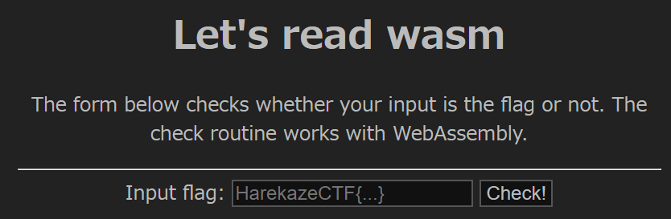
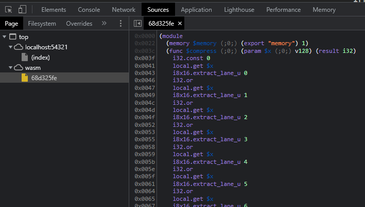
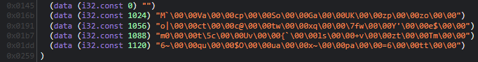

# [Rev] Let's read wasm
> 文字列を入力すると、それがフラグかどうかチェックしてくれるアプリケーションを作りました。WebAssembly製です。
> 
> ---
> 
> I made an application that checks whether an input is the flag or not. It is made with WebAssembly.

添付ファイルとして `module.wasm` というWebAssemblyのバイナリと、それを読み込んで実行する `index.html` が与えられています。PHPであれば `php -S localhost:8000`、Pythonであれば `python -m http.server` のようなコマンドで適当にWebサーバを立てて開いてみると、以下のようにシンプルな入力フォームが表示されました。



`HarekazeCTF{hoge}` のように適当な文字列を入力して `Check!` ボタンを押すと、`Wrong...` と書かれたプロンプトが表示されました。なんとかして正しいフラグを探す必要がありそうです。

## wasmを読む
`index.html` のソースコードをチェックします。`Check!` ボタンを押したときに呼び出される `check` 関数を見てみると、入力された文字列をエンコードしてメモリに書き込んだ後に、WebAssembly側の `check` という関数を呼び出していることがわかります。その返り値がtruthyであれば、入力した文字列が正しかったということになります。

```javascript
      const response = await fetch('module.wasm');
      const bytes = await response.arrayBuffer();
      const { instance } = await WebAssembly.instantiate(bytes, {});
      const buffer = new Uint8Array(instance.exports.memory.buffer);

      function check(flag) {
        for (let i = 0; i < 64; i++) {
          buffer[i] = 0;
        }

        const textEncoder = new TextEncoder();
        const s = textEncoder.encode(flag);
        for (let i = 0; i < s.length; i++) {
          buffer[i] = s[i];
        }

        return instance.exports.check();
      }

      const button = document.getElementById('check');
      const input = document.getElementById('flag');
      button.addEventListener('click', () => {
        if (check(input.value)) {
          alert(`Congratulations! The flag is: ${input.value}`);
        } else {
          alert('Wrong...');
        }
      }, false);
```

wasmの方も見ていきましょう。Google ChromeであればDevToolsを開き、Sourcesタブをクリックしてwasmを選択すると、`module.wasm` を逆アセンブルした結果が表示されます。



### $check
JavaScript側から呼び出されている `check` 関数から見ていきます。最初の `(local $i (;0;) i32) (local $result (;1;) i32)` はローカル変数の宣言であり、それぞれ `i32` という型の `$i`, `$result` というローカル変数がこの関数で使われることを意味します。

WebAssemblyはスタックベースのVMです。最初の2命令を見てみると、`i32.const 0` という命令で0をスタックにプッシュした後に、`local.set $result` という命令によってポップされ `$result` に0が代入されています。

ほかの部分を見てみると、`local.get $i` で `$i` という変数の値を、`i32.const 4` で4をスタックにプッシュして、`i32.shl` はそれらをポップして `$i` を4ビット左にシフトした結果をスタックにプッシュしています。こんな感じで、命令やら関数やらの引数や返り値はスタックを使って受け渡されています。

各命令は基本的に上から下へ順番に実行されていきますが、ループや条件分岐のために `block` や `br_if` といった命令も存在しています。

```
  (func $check (;2;) (export "check") (result i32)
    (local $i (;0;) i32) (local $result (;1;) i32)
    i32.const 0
    local.set $result
    i32.const 0
    local.set $i
    block $label0
      loop $label1
        local.get $i
        i32.const 4
        i32.shl
        local.get $i
        i32.const 5
        i32.shl
        i32.const 1024
        i32.add
        call $check_block
        i32.eqz
        br_if $label0
        local.get $i
        i32.const 1
        i32.add
        local.tee $i
        i32.const 4
        i32.ne
        br_if $label1
      end $label1
      i32.const 1
      local.set $result
    end $label0
    local.get $result
  )
```

各命令の意味を[WebAssembly Reference Manual](https://github.com/sunfishcode/wasm-reference-manual)などで調べつつTypeScript風のコードに直してみると、以下のような処理になっていることがわかります。

```typescript
function $check(): i32 {
    let $i: i32;

    for ($i = 0; $i < 4; $i++) {
        if ($check_block($i << 4, ($i << 5) + 1024) === 0) {
            return 0;
        }
    }

    return 1;
}
```

### $check_block
次は `$check_block` を見ていきます。`v128.load`, `i64x2.splat`, `v128.and` といった命令が含まれているのが特徴的ですが、これらは[SIMD命令](https://github.com/WebAssembly/spec/blob/f5a260a2025ba4d7d398654581c7c532e3a2c319/proposals/simd/SIMD.md)です。

```
  (func $check_block (;1;) (param $offset_input (;0;) i32) (param $offset_enc (;1;) i32) (result i32)
    (local $i (;2;) i32) (local $mask (;3;) i64) (local $block (;4;) v128) (local $result (;5;) i32)
    local.get $offset_input
    v128.load
    local.set $block
    i32.const 0
    local.set $result
    i64.const -9205322385119247871
    local.set $mask
    i32.const 0
    local.set $i
    block $label0
      loop $label1
        local.get $block
        local.get $mask
        i64x2.splat
        v128.and
        call $compress
        local.get $offset_enc
        local.get $i
        i32.const 2
        i32.shl
        i32.add
        i32.load
        i32.ne
        br_if $label0
        local.get $mask
        i64.const 8
        i64.rotr
        local.set $mask
        local.get $i
        i32.const 1
        i32.add
        local.tee $i
        i32.const 8
        i32.ne
        br_if $label1
      end $label1
      i32.const 1
      local.set $result
    end $label0
    local.get $result
  )
```

この関数もTypeScriptっぽいコードに直すと以下のようになります。まず第一引数として与えられたオフセットを使って、ユーザが入力した文字列から16バイトを取得し `$block` というローカル変数に格納しています。それと `$mask` とのビット論理積を取ることで、各バイトから1ビットずつ抽出しています。

その結果を `compress` という関数に与え、返り値と第二引数として与えられたメモリのオフセットを元にメモリから数値を取得して比較しています。その後 `$mask` を8ビット右にローテートし、`$block` からまた別のビットを抽出し…という処理を8回繰り返しています。

```typescript
function $check_block($offset_input: i32, $offset_enc: i32): i32 {
    let $i: i32;
    let $mask: i64;
    let $block: v128;

    $block = v128_load($offset_input);
    $mask = 0x8040201008040201;

    for ($i = 0; $i < 8; $i++) {
        if (
            compress(i64x2_splat($mask) & $block) !==
            i32_load($offset_enc + ($i << 2))
        ) {
            return 0;
        }

        $mask = i64_rotr($mask, 8);
    }

    return 1;
}
```

### $compress
`$check_block` から呼ばれている `$compress` を確認します。ここで使われている `i8x16.extract_lane_u` は `v128` から指定した8ビットだけを取り出す命令です。

```
  (func $compress (;0;) (param $x (;0;) v128) (result i32)
    i32.const 0
    local.get $x
    i8x16.extract_lane_u 0
    i32.or
    local.get $x
    i8x16.extract_lane_u 1
    i32.or
    local.get $x
    i8x16.extract_lane_u 2
    i32.or
    local.get $x
    i8x16.extract_lane_u 3
    i32.or
    local.get $x
    i8x16.extract_lane_u 4
    i32.or
    local.get $x
    i8x16.extract_lane_u 5
    i32.or
    local.get $x
    i8x16.extract_lane_u 6
    i32.or
    local.get $x
    i8x16.extract_lane_u 7
    i32.or
    i32.const 8
    i32.shl
    local.get $x
    i8x16.extract_lane_u 8
    i32.or
    local.get $x
    i8x16.extract_lane_u 9
    i32.or
    local.get $x
    i8x16.extract_lane_u 10
    i32.or
    local.get $x
    i8x16.extract_lane_u 11
    i32.or
    local.get $x
    i8x16.extract_lane_u 12
    i32.or
    local.get $x
    i8x16.extract_lane_u 13
    i32.or
    local.get $x
    i8x16.extract_lane_u 14
    i32.or
    local.get $x
    i8x16.extract_lane_u 15
    i32.or
  )
```

この関数をTypeScriptっぽいコードに直すと以下のようになります。ビット論理和とビットシフトによって `v128` を `i32` に圧縮しています。

```typescript
function $compress($x: v128): i32 {
    let $result: i32 = 0;

    for (let $i: i32 = 0; $i < 8; $i++) {
        $result |= i8x16_extract_lane_u($x, $i);
    }
    $result = $result << 8;

    for (let $i: i32 = 8; $i < 16; $i++) {
        $result |= i8x16_extract_lane_u($x, $i);
    }

    return $result;
}
```

## ソルバを書く
さて、ここまでの解析で、以下のようにメモリに配置されているバイト列はフラグの各ビットがシャッフルされたものであることがわかりました。



このバイト列に対して `$compress`, `$check_block`, `$check` とは逆の処理をするPythonスクリプトを書きましょう。

```python
import binascii
import struct

def decode(s):
  res = [0 for _ in range(16)]

  for i in range(8):
    for j in range(8):
      res[i] |= (s[j] & 1 << ((i + j) % 8 + 8)) >> 8

  for i in range(8, 16):
    for j in range(8):
      res[i] |= s[j] & 1 << ((i + j) % 8)

  return ''.join(chr(c) for c in res)

enc = '''
4D 60 00 00 56 61 00 00 63 70 00 00 53 6F 00 00 47 61 00 00 55 4B 00 00 7A 70 00 00 7A 6F 00 00
6F 7C 00 00 63 74 00 00 63 40 00 00 74 77 00 00 78 71 00 00 7F 77 00 00 59 27 00 00 65 24 00 00
6D 30 00 00 74 5C 00 00 55 76 00 00 7B 60 00 00 6C 73 00 00 2B 76 00 00 7A 74 00 00 54 6D 00 00
36 7E 00 00 71 75 00 00 24 4F 00 00 75 61 00 00 78 7E 00 00 70 61 00 00 3D 36 00 00 74 74 00 00
'''.strip().splitlines()
enc = [binascii.unhexlify(line.replace(' ', '')) for line in enc]
enc = [struct.unpack('<IIIIIIII', line) for line in enc]

flag = ''.join(decode(line) for line in enc)
print(flag)
```

実行するとフラグが得られました。

```
$ python solve.py
HarekazeCTF{I_wr0te_web4ssembly_text_f0rm4t_by_h4nd_tsuk4ret4y0}
```

```
HarekazeCTF{I_wr0te_web4ssembly_text_f0rm4t_by_h4nd_tsuk4ret4y0}
```